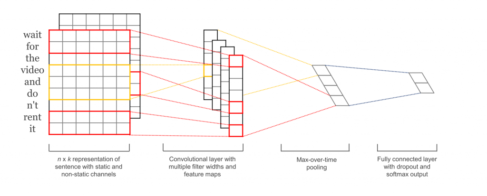

# CNN-for-Sentence-Classification-in-Chainer

Implementation of Yoon Kim's [Convolutional Neural Networks for Sentence Classification](https://arxiv.org/abs/1408.5882) with Chainer.

> Abstract (from Cornell university library)
>We report on a series of experiments with convolutional neural networks (CNN) trained on top of pre-trained word vectors for sentence-level classification tasks. We show that a simple CNN with little hyperparameter tuning and static vectors achieves excellent results on multiple benchmarks. Learning task-specific vectors through fine-tuning offers further gains in performance. We additionally propose a simple modification to the architecture to allow for the use of both task-specific and static vectors. The CNN models discussed herein improve upon the state of the art on 4 out of 7 tasks, which include sentiment analysis and question classification.



- [Yoon Kim's TensorFlow implementation repo](https://github.com/yoonkim/CNN_sentence)
- [Google Prerained Word2Vec model](https://code.google.com/archive/p/word2vec/)
- [skipgram Word2Vec on Chainer example](https://github.com/chainer/chainer/tree/master/examples/word2vec)

## Requirements

- [numpy](http://www.numpy.org/)
- [pandas](https://pandas.pydata.org/)
- [chainer](https://chainer.org/)
- [gensim.models Word2vec](https://radimrehurek.com/gensim/)


## Sample Texts for Classification

datasets from [cornell dataset](http://www.cs.cornell.edu/people/pabo/movie-review-data/)

```
# data location
data/
    |_pos/
    |    |_cv000_01.txt
    |    |_cv000_02.txt
    |      :
    |_neg/
        |_cv000_01.txt
        |_cv000_02.txt
           :
```

or get data like this.

```bash
cd data
wget http://ai.stanford.edu/~amaas/data/sentiment/aclImdb_v1.tar.gz -O imdb.tar.gz
tar -xf imdb.tar.gz
```

## Sample Classification Demo

```python
import cnn_sentence

clf = cnn_sentence.sample_train("CNN_rand")
```

results...  

```
epoch       elapsed_time  main/loss   validation/main/loss  main/accuracy  validation/main/accuracy
1           129.698       0.701306    0.692502              0.518555       0.497461                  
2           256.704       0.659536    0.689695              0.648438       0.550195                  
3           382.597       0.614391    0.688409              0.708333       0.532812                  
4           513.592       0.542008    0.687492              0.810547       0.566992                  
5           638.055       0.427749    0.695113              0.917969       0.516992             
```


## [WIP] Usage

when use other data

```python
import cnn_sentence, data_builder

data = data_builder.Data("DATANAME", "LIST-OF-FILEPATH", "LABELS").load()
dataset = data.get_chainer_dataset()

clf = cnn_sentence.train(dataset=dataset)
```
